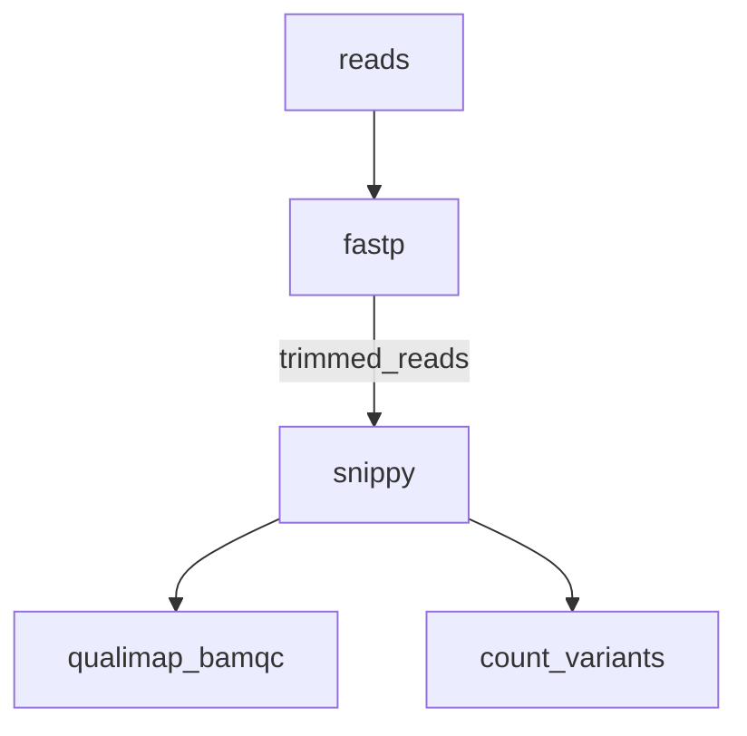

[](https://github.com/BCCDC-PHL/snippy-variants/actions/workflows/tests.yml)

# snippy-variants

Perform read mapping and variant calling using [snippy](https://github.com/tseemann/snippy).



## Usage

```
nextflow run BCCDC-PHL/snippy-variants \
  --ref </path/to/ref.fa> \
  --fastq_input </path/to/fastqs> \
  --outdir </path/to/output_dir>
```

### Parameters

| Flag                         | Default Value | Description                                       |
|:-----------------------------|--------------:|:--------------------------------------------------|
| `mincov`                  |           10     | Minimum number of reads covering a site to be considered.       |
| `minfrac`                 |           0      | Minimum proportion of those reads which must differ from the reference. |
| `basequal`                |           13     | Minimum quality a nucleotide needs to be used in variant calling.  |
| `mapqual`                 |           60     | Minimum mapping quality to accept in variant calling. |


## Output

An output directory will be created for each sample under the directory provided for the `--outdir` flag.

The following files will be produced for each sample:

```
.
└── sample-01
    ├── sample-01_TIMESTAMP_provenance.yml
    ├── sample-01.aligned.fa
    ├── sample-01.bam 
    ├── sample-01.bam.bai
    ├── sample-01_bamqc
    ├── sample-01.bed
    ├── sample-01.consensus.fa
    ├── sample-01.consensus.subs.fa
    ├── sample-01.csv 
    ├── sample-01_fastp.csv
    ├── sample-01_fastp.json
    ├── sample-01.filt.vcf
    ├── sample-01.gff
    ├── sample-01.html
    ├── sample-01.log
    ├── sample-01.raw.vcf
    ├── sample-01.report.txt
    ├── sample-01.subs.vcf
    ├── sample-01.tab 
    ├── sample-01.txt
    ├── sample-01.vcf
    ├── sample-01.vcf.gz
    ├── sample-01.vcf.gz.csi
    └── reference
```


## Provenance

In the output directory for each sample, a provenance file will be written with the following format:
```
- pipeline_name: BCCDC-PHL/snippy-nf
  pipeline_version: 0.1.1
  nextflow_session_id: 9b6520b6-2997-495c-9dd1-34c96c4525a2
  nextflow_run_name: special_faggin
  analysis_start_time: 2025-08-22T13:13:54.936433-07:00
- input_filename: sample01_S12_L001_R1_001.fastq.gz
  file_type: fastq-input
  sha256: 925211cd402243bb4a2276e3751cd12b4d9aeb06f7cc2e7c266a5503a273bea3
- input_filename: sample01_S12_L001_R2_001.fastq.gz
  file_type: fastq-input
  sha256: 29e8a004bae2b98f4b1dbb42b122490210c1afd719987e2ae53b1242d696f70f
- process_name: fastp
  tools:
    - tool_name: fastp
      tool_version: 0.20.1
- process_name: snippy
  tools:
    - tool_name: snippy
      tool_version: 4.6.0
      parameters:
        - parameter: --mincov
          value: 10
        - parameter: --basequal
          value: 13
        - parameter: --mapqual
          value: 60
        - parameter: --minfrac
          value: 0
        - parameter: --ref
          value: H37Rv_NC000962.3.fasta
        - parameter: --R1
          value: sample01_trimmed_R1.fastq.gz
        - parameter: --R2
          value: sample01_trimmed_R2.fastq.gz
- process_name: qualimap
  tools:
    - tool_name: qualimap
      tool_version: v.2.2.2-dev
      subcommand: bamqc
      parameters:
        - parameter: --bam
          value: sample01.bam

```